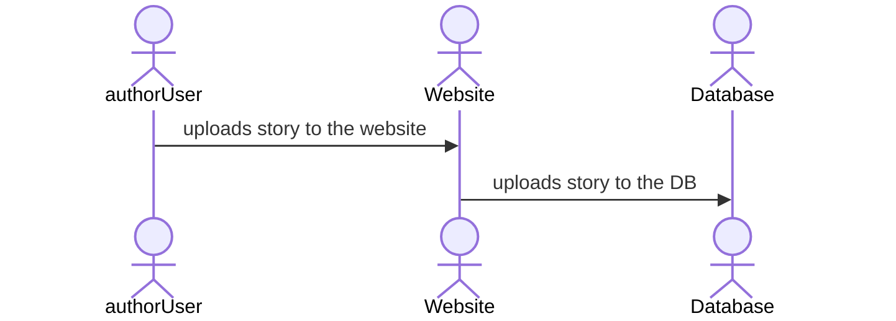
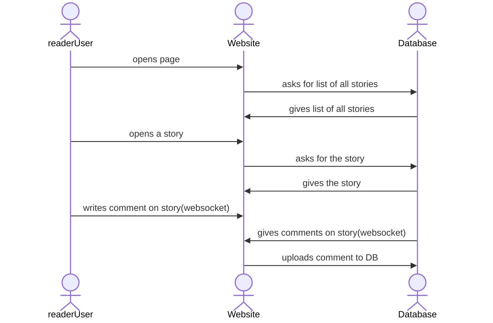

# GreyhoundWriting

[My Notes](notes.md)

A writing platform designed for writers and readers to publish and review eachothers work. 

> [!NOTE]
> What does one snowman say to the other?  
> ʇsoɹɹɐɔ ǝʞᴉl sllǝɯs ʇᴉ  

> [!NOTE]
>  For markdown [documentation](https://docs.github.com/en/get-started/writing-on-github/getting-started-with-writing-and-formatting-on-github/basic-writing-and-formatting-syntax)

## 🚀 Specification Deliverable

> [!NOTE]
>  Example [example](https://github.com/webprogramming260/startup-example/blob/main/README.md) for inspiration.

For this deliverable I did the following. I checked the box `[x]` and added a description for things I completed.

- [X] Proper use of Markdown
- [X] A concise and compelling elevator pitch
- [X] Description of key features
- [X] Description of how you will use each technology
- [X] One or more rough sketches of your application. Images must be embedded in this file using Markdown image references.

### Elevator pitch

Greyhound Writing is a platform designed for young writers to easily publish and get feedback to improve their writing to help them reach their maximum potential as authors. (Older authors can participate as well.) Few advertisements are used to make money, which is primarily given to the authors. It is sort of designed as a way for a school writing club to publish the short stories they write and make a little money off of it. It can also be used for journalism, nonfiction or stories, anything the writer wishes.
### Design

<!--  -->

The authorUser uploads a story, which the Website saves to the Database. A readerUser accesses the website, first requesting a list of all stories from the database and then selecting a specific story to read. When the reader writes a comment on the story, the interaction uses a WebSocket connection to send the comment to the website in real-time. The Website saves the comment to the DB and retrieves updated comments with the same WebSocket channel, ensuring that the reader sees live updates.

### Key features

- Options for new users to view and read different stories published by other authors.
- Ways for users to comment and give public or private feedback to the authors.
- A messaging board
- A home page for authors with accounts where they can upload new stories and view feedback.

### Technologies

I am going to use the required technologies in the following ways.

- **HTML** - Design and layout the website, putting in the necessary boxes, text, and blueprints.
- **CSS** - Fill in the details and color of the website. 
- **React** - There will be an upload story, buttons for navigation, it would be nice to emplement a little filter for bad language in the reviews. 
- **Service** - Endpoints are as follows:
    - get stories
    - delete story, for the author only
    - add story
    - get comments (websocket)
    - add comments (websocket)
    - get users
    - add users
    - add conversation (websocket, if possible)
    - get conversation (websocket, if possible)
    - add message (websocket, if possible)
    - get messages (websocket, if possible)

- **DB/Login** - stores the authors/readers/users, their stories, each stories' reviews. Contains all authentication needed, such as only valid users can make, view, and review stories. 
- **WebSocket** - The comments/reviews will be the websocket. If we have extra time or that doesn't work then we can add messaging.   

## 🚀 AWS deliverable

For this deliverable I did the following. I checked the box `[x]` and added a description for things I completed.

- [X] **Server deployed and accessible with custom domain name** - [My server link](https://greyhoundwriting.click).

## 🚀 HTML deliverable

For this deliverable I did the following. I checked the box `[x]` and added a description for things I completed.

- [X] **HTML pages** - added HTML pages including `authorAccount.html`, `demo.html`, `1ststory.html`, `manyStories.html`, and `index.html` to structure the web application.
- [X] **Proper HTML element usage** - Used HTML elements such as `<nav>`, `<main>`, `<form>`, and `
` 
- [X] **Links** - Added navigation links between pages and to the GitHub repository.
- [X] **Text** - added text elements to display information about stories, authors, and login details.
- [X] **3rd party API placeholder** - stubbed out a 3rd party API to enhance functionality.
- [X] **Images** - Added images such as profile pictures and an attemted page turn animation.
- [X] **Login placeholder** - login form in `index.html` to display the author's account name.
- [X] **DB data placeholder** - Placeholder for database functionality to store and retrieve data.
- [X] **WebSocket placeholder** - Placeholder for WebSocket functionality for comments and messages.

## 🚀 CSS deliverable

For this deliverable I did the following. I checked the box `[x]` and added a description for things I completed.

- [x] **Header, footer, and main content body** - I completed this part of the deliverable. The structure of each page is laid out as seen in the pages listed under design (scroll up)
- [x] **Navigation elements** - I  completed this part of the deliverable. Added navlinks that go to each page, on each page. 
- [x] **Responsive to window resizing** - I completed this part of the deliverable. Added a meta tag.
- [x] **Application elements** - I completed this part of the deliverable.
- [x] **Application text content** - I completed this part of the deliverable.
- [x] **Application images** - I completed this part of the deliverable. Added a website logo.

## 🚀 React part 1: Routing deliverable

For this deliverable I did the following. I checked the box `[x]` and added a description for things I completed.

- [x] **Bundled using Vite** - I completed this part of the deliverable. we used vite to tell the backend which port (localhost:3000) to connect to.
- [x] **Components** - I have my login, author account, story, and many stories pages
- [x] **Router** - Routing between login and different pages.

## 🚀 React Part 2: Reactivity

For this deliverable I did the following. I checked the box `[x]` and added a description for things I completed.

- [x] **All functionality implemented or mocked out** – Authors can log in, register, upload `.txt` stories, view story previews, and leave reviews. Input is validated for `.txt` file type.
- [x] **Hooks** – I used `useEffect` to load stories and reviews, `useState` to manage form data and display updates, and `useParams` to get story IDs from URLs dynamically.

## 🚀 Service Deliverable

For this deliverable I did the following. I checked the box `[x]` and added a description for things I completed.

- [x] **Node.js/Express HTTP service** – The Express backend handles all the routing, authentication, file uploads, review handling, and MongoDB data access.
- [x] **Static middleware for frontend** – The frontend React app is served using Express’ static middleware.
- [x] **Calls to third party endpoints** – (Optional) Not implemented in this project. No external APIs were called, but architecture is prepared for expansion.
- [x] **Backend service endpoints** – Endpoints like `/api/auth/login`, `/api/upload`, `/api/stories`, and `/api/review` are all implemented and connected to MongoDB.
- [x] **Frontend calls service endpoints** – The frontend uses `fetch()` with `credentials: 'include'` to communicate with secure backend endpoints.

## 🚀 DB/Login Deliverable

For this deliverable I did the following. I checked the box `[x]` and added a description for things I completed.

- [x] **User registration** – Authors can create accounts that are saved to MongoDB.
- [x] **User login and logout** – Login and logout functionality with session-based cookies is implemented. Logout is available via the navigation bar.
- [x] **Stores data in MongoDB** – All story and review data persists in MongoDB even if the server restarts.
- [x] **Stores credentials in MongoDB** – User email and securely hashed passwords are stored in MongoDB.
- [x] **Restricts functionality based on authentication** – Users must be logged in to access routes like `/manyStories`, `/upload`, and `/story/:id`.

## 🚀 WebSocket Deliverable

For this deliverable I did the following. I checked the box `[x]` and added a description for things I completed.

- [x] **Backend listens for WebSocket connection** – Express server is extended to support WebSocket connections via the `ws` library.
- [x] **Frontend makes WebSocket connection** – Frontend connects to the backend WebSocket server on mount.
- [x] **Data sent over WebSocket connection** – When a new review is posted, the backend broadcasts it via WebSocket to all connected clients.
- [x] **WebSocket data displayed** – The frontend listens for WebSocket messages and updates the review list in real-time.
- [x] **Application is fully functional** – Story uploads, user login, reviews, and WebSocket-based real-time updates are all working together as intended.

---

## 📚 Comprehensive Project Summary & Documentation

### Overview
Greyhound Writing is a full-stack web platform for young and aspiring authors to publish, share, and receive feedback on their stories. The platform supports user registration, secure login, story uploads, real-time reviews via WebSockets, and robust admin controls for content moderation.

### Features
- **User Registration & Login:** Secure authentication with hashed passwords and session cookies.
- **Story Management:**
  - Authors can upload `.txt` stories.
  - All users can browse and read stories.
  - Admin users (`vwj1776`, `nodlev`, `vwj1776@gmail.com`) can delete any story.
- **Reviews & Comments:**
  - Users can leave reviews on stories.
  - Reviews are broadcast in real-time to all connected clients using WebSockets.
- **Admin Controls:**
  - Only admin users can delete stories (both via UI and backend API).
  - Admin check is enforced in both frontend and backend for security.
- **Responsive UI:**
  - Built with React and Vite for fast, modern user experience.
  - Navigation, login, registration, and story browsing are all componentized.
- **Backend Service:**
  - Node.js/Express REST API for all data operations.
  - MongoDB for persistent storage of users, stories, and reviews.
  - WebSocket server for real-time review updates.
- **Security:**
  - All sensitive routes require authentication.
  - Admin-only actions are double-checked on the server.
  - Passwords are hashed with bcrypt.

### API Endpoints
- `POST /api/auth/create` – Register a new user
- `POST /api/auth/login` – Login and receive session cookie
- `DELETE /api/auth/logout` – Logout and clear session
- `GET /api/stories` – Get all stories (auth required)
- `POST /api/upload` – Upload a new story (auth required)
- `DELETE /api/story/:id` – Delete a story (admin only)
- `GET /api/reviews?storyId=...` – Get reviews for a story
- `POST /api/review` – Add a review to a story
- `POST /api/chat/ask` – (Experimental) Chatbot Q&A endpoint

### Admin Users
- Only the following users are considered admins and can delete stories:
  - `vwj1776`
  - `nodlev`
  - `vwj1776@gmail.com`

### Running the Project
- **Frontend:**
  - `npm run dev` (from project root)
- **Backend:**
  - `cd service && npm start` or `node index.js`
- **MongoDB:**
  - Ensure MongoDB is running and accessible as configured in `service/dbConfig.json`.

### Deployment
- The project is deployed at [https://greyhoundwriting.click](https://greyhoundwriting.click)
- Deployment uses a shell script: `../deployFiles.sh -k ../keys/production.pem -h greyhoundwriting.click -s simon`

### Technologies Used
- React, Vite, HTML, CSS
- Node.js, Express, MongoDB, bcrypt, ws (WebSocket)

### Security & Best Practices
- All API endpoints requiring authentication use a session cookie.
- Only admins can delete stories, enforced on both frontend and backend.
- Passwords are never stored in plain text.
- All user input is validated on both client and server.

### Contribution & Future Work
- Add more granular user roles (e.g., moderators)
- Expand messaging and chat features
- Add story editing and version history
- Improve mobile responsiveness and accessibility
- Integrate third-party APIs for additional features

---

../deployFiles.sh -k ../keys/production.pem -h greyhoundwriting.click -s simon